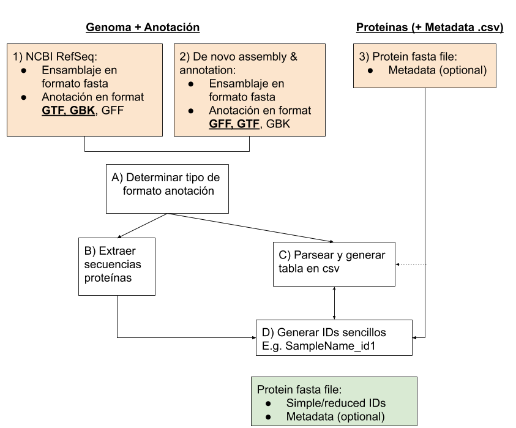

# Entrada de datos e información

En nuestro proyecto la información puede provenir de diferentes sitios y tener diferente formato:
1) Que nosotros descarguemos esa información (Para hacer más adelante) directamente de NCBI de la base de datos RefSeq o GenBank (repositorio ftp). Ver ejemplo en la carpeta "TFM_UOC_AMoya/data/example_NCBI"
2) Que el usuario nos aporte un ensamblaje de novo y una anotación de novo. Ver ejemplo en la carpeta "TFM_UOC_AMoya/data/example_denovo"
3) Que el usuario nos de una serie de proteínas de interés. Ver ejemplo en la carpeta "TFM_UOC_AMoya/data/example_protein"

Por tanto, dependiendo del tipo de información, el tratamiento de esta será diferente y necesitaremos realizar una serie de funciones. Hay algunos puntos en comun y el resultado final es el mismo, por ello, vamos a intentar unificar todo el proceso.

Ver detalle en la siguiente figura:

